

# PIForge

**Premium custom symbols and tools for AVEVA PI Vision**

Drop-in symbols for AVEVA PI Vision: flow diagrams, Gantt timelines, predictive gauges,
operator data entry and more. Licensed per server, delivered instantly, 30-day support included.
Every product has a live video demo on its page.

---

## Analytics & Visualization

<table>
<tr><td align="center" valign="top" width="33%"><a href="https://piforge.app/product?id=10">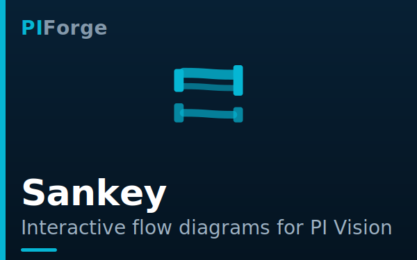</a> <a href="https://piforge.app/product?id=10"><b>Sankey</b></a> Interactive flow diagrams with AF auto-build <b>$149</b></td><td align="center" valign="top" width="33%"><a href="https://piforge.app/product?id=11">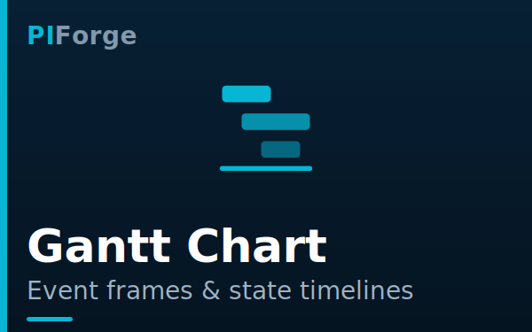</a> <a href="https://piforge.app/product?id=11"><b>Gantt Chart</b></a> Event frames and state timelines with downtime Pareto <b>$249</b></td><td align="center" valign="top" width="33%"><a href="https://piforge.app/product?id=7">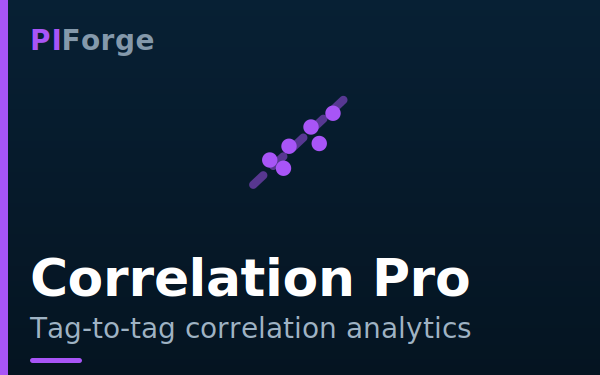</a> <a href="https://piforge.app/product?id=7"><b>Correlation Pro</b></a> Density, rolling correlation, trajectory, correlation matrix <b>$249</b></td></tr>
<tr><td align="center" valign="top" width="33%"><a href="https://piforge.app/product?id=8">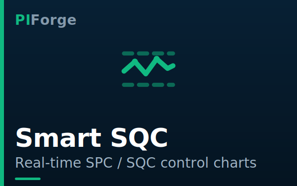</a> <a href="https://piforge.app/product?id=8"><b>Smart SQC</b></a> Real-time SPC monitoring with zero configuration overhead <b>$249</b></td><td align="center" valign="top" width="33%"><a href="https://piforge.app/product?id=4">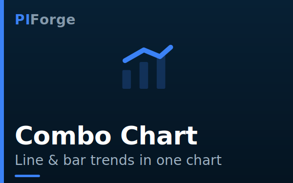</a> <a href="https://piforge.app/product?id=4"><b>Combo Chart</b></a> Two Y-axes, multiple series, real-time data from PI tags <b>$149</b></td></tr>
</table>

## Gauges & KPI

<table>
<tr><td align="center" valign="top" width="33%"><a href="https://piforge.app/product?id=12">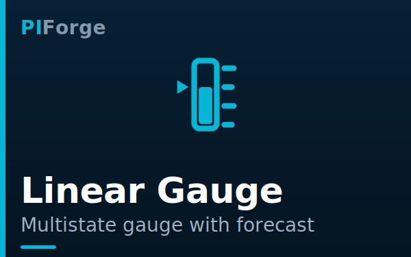</a> <a href="https://piforge.app/product?id=12"><b>Linear Gauge</b></a> Multistate linear gauge with time-to-limit forecast <b>$99</b></td><td align="center" valign="top" width="33%"><a href="https://piforge.app/product?id=13">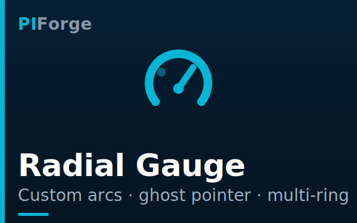</a> <a href="https://piforge.app/product?id=13"><b>Radial Gauge</b></a> Custom-arc radial gauge with ghost pointer and multi-ring <b>$99</b></td></tr>
</table>

## Operations & Data Entry

<table>
<tr><td align="center" valign="top" width="33%"><a href="https://piforge.app/product?id=16">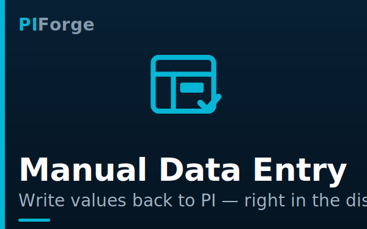</a> <a href="https://piforge.app/product?id=16"><b>Manual Data Entry</b></a> Operator data entry with PI Web API write-back <b>$199</b></td><td align="center" valign="top" width="33%"><a href="https://piforge.app/product?id=14">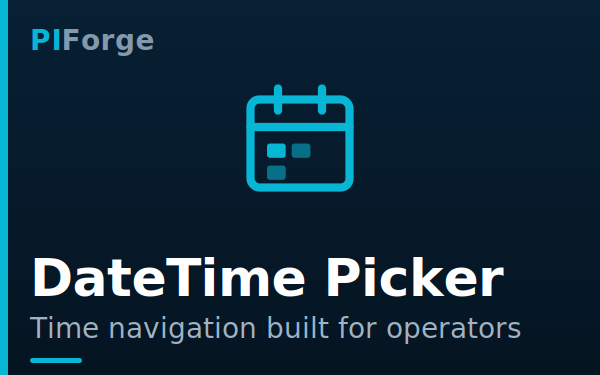</a> <a href="https://piforge.app/product?id=14"><b>DateTime Picker</b></a> Operator time navigation: presets, calendar, events, sync <b>$149</b></td><td align="center" valign="top" width="33%"><a href="https://piforge.app/product?id=6">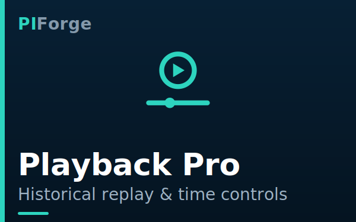</a> <a href="https://piforge.app/product?id=6"><b>Playback Pro</b></a> Turn any display into a historical replay console <b>$199</b></td></tr>
<tr><td align="center" valign="top" width="33%"><a href="https://piforge.app/product?id=3">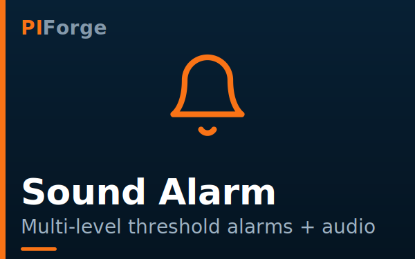</a> <a href="https://piforge.app/product?id=3"><b>Sound Alarm</b></a> Three thresholds, instant visual and audio escalation <b>$99</b></td></tr>
</table>

## Dashboard Infrastructure

<table>
<tr><td align="center" valign="top" width="33%"><a href="https://piforge.app/product?id=9">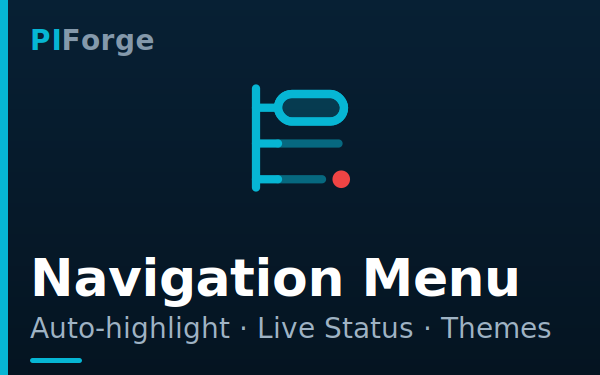</a> <a href="https://piforge.app/product?id=9"><b>Navigation Menu</b></a> Build menus, live status, auto-highlight <b>$149</b></td><td align="center" valign="top" width="33%"><a href="https://piforge.app/product?id=15">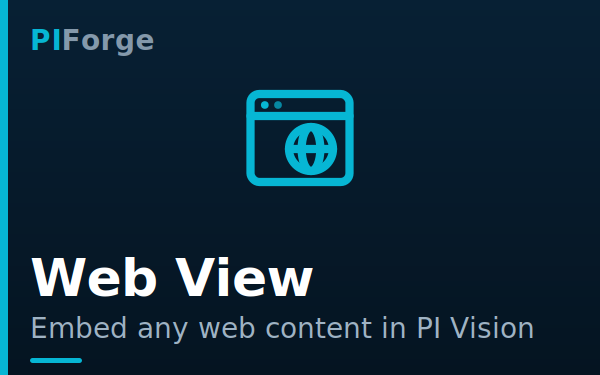</a> <a href="https://piforge.app/product?id=15"><b>Web View</b></a> Embed web pages and displays: grids, slideshows, time-synced URLs <b>$149</b></td><td align="center" valign="top" width="33%"><a href="https://piforge.app/product?id=5">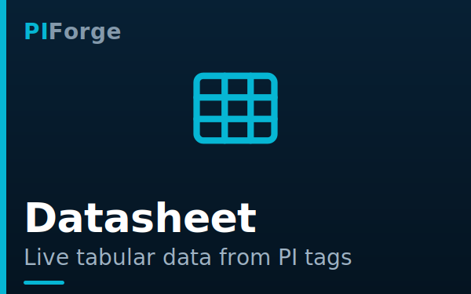</a> <a href="https://piforge.app/product?id=5"><b>Datasheet</b></a> Drop a tag, get live data — no scripting <b>$199</b></td></tr>
</table>

## Coming Soon

<table>
<tr><td align="center" valign="top" width="33%"><a href="https://piforge.app/product?id=17">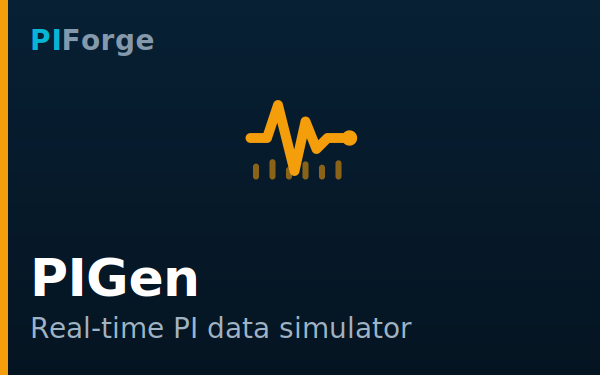</a> <a href="https://piforge.app/product?id=17"><b>PIGen</b></a> Real-time PI data simulator: living dashboards for demos, training, and testing <b>Coming Soon</b></td></tr>
</table>

---

## Free Tools

| Tool | Description | Get it |
|---|---|---|
| **Combo Chart — Free Edition** | Trend line + bar series on one time axis, free for any PI Vision deployment | [GitHub](https://github.com/PIForge-dev/piforge-combo-chart-free) · [GitLab](https://gitlab.com/contact.piforge/piforge-combo-chart-free) |

## Support

- Marketplace: [piforge.app/market](https://piforge.app/market)
- Documentation: [piforge.app/docs](https://piforge.app/docs.html)
- Contact: [contact.piforge@gmail.com](mailto:contact.piforge@gmail.com)
