

# PIForge

**Premium custom symbols and tools for AVEVA PI Vision**

Drop-in symbols for AVEVA PI Vision: flow diagrams, Gantt timelines, predictive gauges,
operator data entry and more. Licensed per server, delivered instantly, 30-day support included.
Every product has a live video demo on its page.

---

## Analytics & Visualization

<table>
<tr><td align="center" valign="top" width="33%"><a href="https://piforge.app/product/correlation-pro">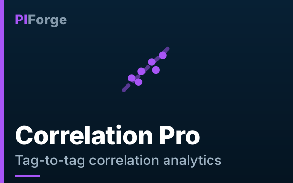</a> <a href="https://piforge.app/product/correlation-pro"><b>Correlation Pro</b></a> Density, rolling correlation, trajectory, correlation matrix <b>$249</b></td><td align="center" valign="top" width="33%"><a href="https://piforge.app/product/smart-sqc">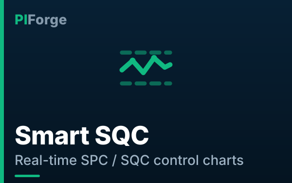</a> <a href="https://piforge.app/product/smart-sqc"><b>Smart SQC</b></a> Real-time SPC monitoring with zero configuration overhead <b>$249</b></td><td align="center" valign="top" width="33%"><a href="https://piforge.app/product/sankey">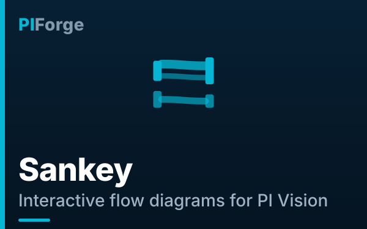</a> <a href="https://piforge.app/product/sankey"><b>Sankey</b></a> Interactive flow diagrams with AF auto-build <b>$149</b></td></tr>
<tr><td align="center" valign="top" width="33%"><a href="https://piforge.app/product/gantt-chart">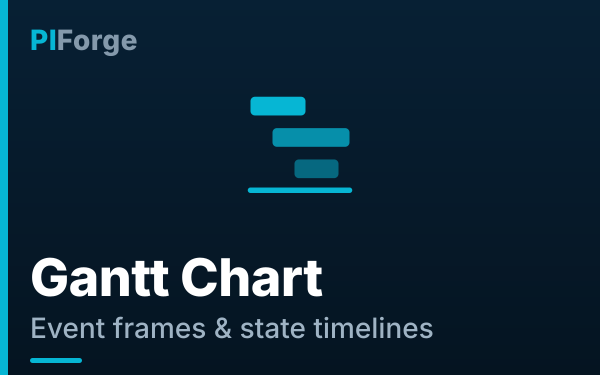</a> <a href="https://piforge.app/product/gantt-chart"><b>Gantt Chart</b></a> Event frames and state timelines with downtime Pareto <b>$249</b></td><td align="center" valign="top" width="33%"><a href="https://piforge.app/product/combo-chart">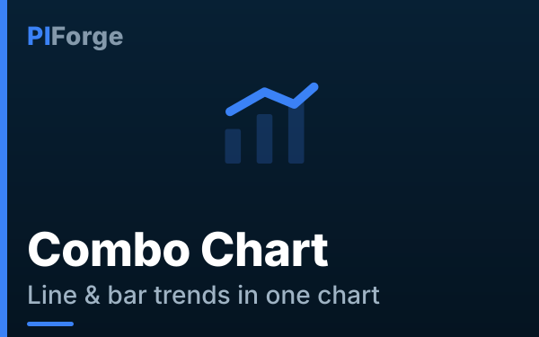</a> <a href="https://piforge.app/product/combo-chart"><b>Combo Chart</b></a> Two Y-axes, multiple series, real-time data from PI tags <b>$149</b></td><td align="center" valign="top" width="33%"><a href="https://piforge.app/product/histogram">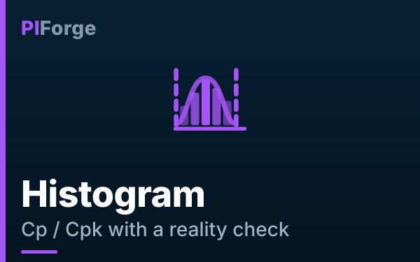</a> <a href="https://piforge.app/product/histogram"><b>Histogram</b></a> Distribution with process capability (Cp/Cpk), sigma and normality <b>$149</b></td></tr>
<tr><td align="center" valign="top" width="33%"><a href="https://piforge.app/product/radar">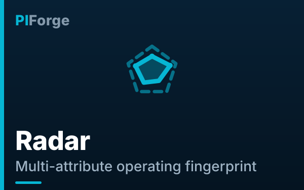</a> <a href="https://piforge.app/product/radar"><b>Radar</b></a> Multi-attribute operating fingerprint with normal envelope <b>$199</b></td><td align="center" valign="top" width="33%"><a href="https://piforge.app/product/timelap">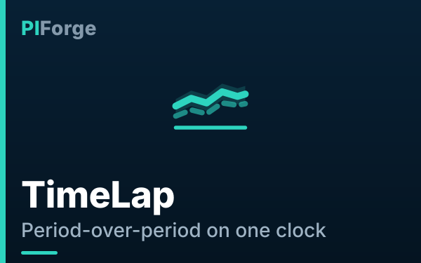</a> <a href="https://piforge.app/product/timelap"><b>TimeLap</b></a> Period overlay (today / MoM / YoY) with typical-profile band <b>$199</b></td><td align="center" valign="top" width="33%"><a href="https://piforge.app/product/duval">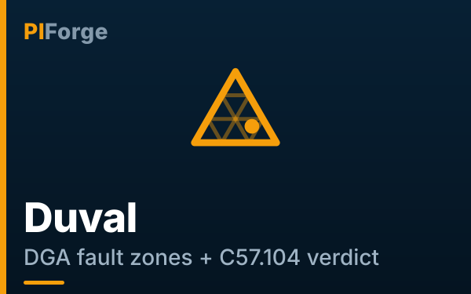</a> <a href="https://piforge.app/product/duval"><b>Duval</b></a> Dissolved-gas diagnostic: Duval triangles + C57.104 verdict <b>$199</b></td></tr>
</table>

## Gauges & KPI

<table>
<tr><td align="center" valign="top" width="33%"><a href="https://piforge.app/product/linear-gauge">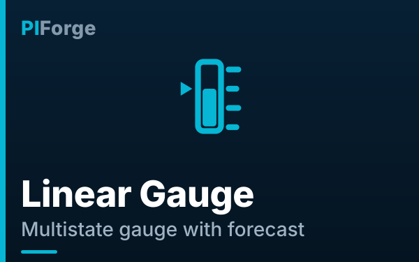</a> <a href="https://piforge.app/product/linear-gauge"><b>Linear Gauge</b></a> Multistate linear gauge with time-to-limit forecast <b>$99</b></td><td align="center" valign="top" width="33%"><a href="https://piforge.app/product/radial-gauge">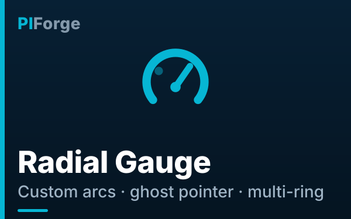</a> <a href="https://piforge.app/product/radial-gauge"><b>Radial Gauge</b></a> Custom-arc radial gauge with ghost pointer and multi-ring <b>$99</b></td></tr>
</table>

## Operations & Data Entry

<table>
<tr><td align="center" valign="top" width="33%"><a href="https://piforge.app/product/alarmiq">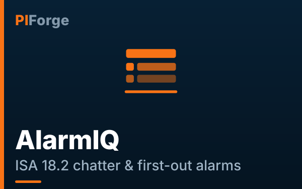</a> <a href="https://piforge.app/product/alarmiq"><b>AlarmIQ</b></a> Alarm table with ISA 18.2 chatter, first-out and bad-actor Pareto <b>$199</b></td><td align="center" valign="top" width="33%"><a href="https://piforge.app/product/manual-data-entry">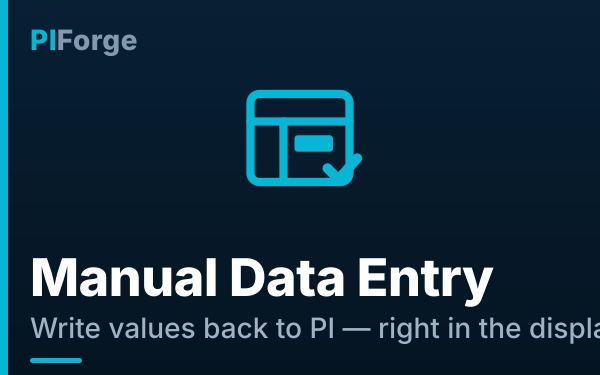</a> <a href="https://piforge.app/product/manual-data-entry"><b>Manual Data Entry</b></a> Operator data entry with PI Web API write-back <b>$199</b></td><td align="center" valign="top" width="33%"><a href="https://piforge.app/product/datetime-picker">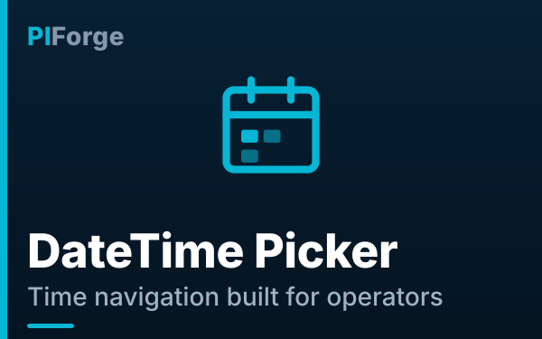</a> <a href="https://piforge.app/product/datetime-picker"><b>DateTime Picker</b></a> Operator time navigation: presets, calendar, events, sync <b>$149</b></td></tr>
<tr><td align="center" valign="top" width="33%"> <a href="https://piforge.app/product/playback-pro"><b>Playback Pro</b></a> Turn any display into a historical replay console <b>$199</b></td><td align="center" valign="top" width="33%"><a href="https://piforge.app/product/sound-alarm">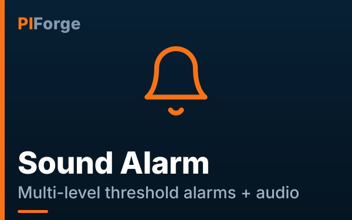</a> <a href="https://piforge.app/product/sound-alarm"><b>Sound Alarm</b></a> Three thresholds, instant visual and audio escalation <b>$99</b></td></tr>
</table>

## Dashboard Infrastructure

<table>
<tr><td align="center" valign="top" width="33%"> <a href="https://piforge.app/product/navigation-menu"><b>Navigation Menu</b></a> Build menus, live status, auto-highlight <b>$149</b></td><td align="center" valign="top" width="33%"><a href="https://piforge.app/product/web-view">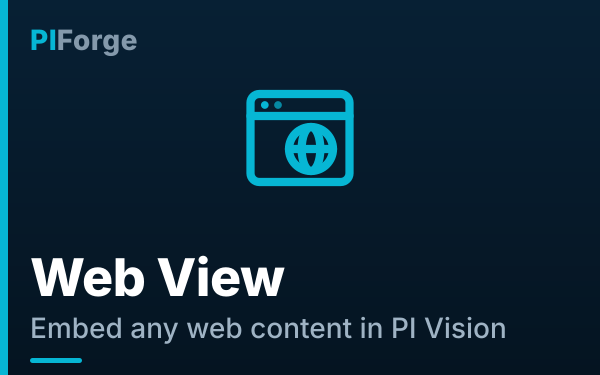</a> <a href="https://piforge.app/product/web-view"><b>Web View</b></a> Embed web pages and displays: grids, slideshows, time-synced URLs <b>$149</b></td><td align="center" valign="top" width="33%"><a href="https://piforge.app/product/datasheet">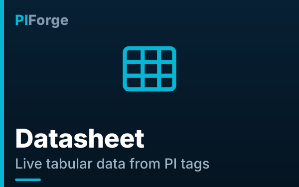</a> <a href="https://piforge.app/product/datasheet"><b>Datasheet</b></a> Drop a tag, get live data — no scripting <b>$199</b></td></tr>
</table>

## Tools & Utilities

<table>
<tr><td align="center" valign="top" width="33%"><a href="https://piforge.app/product/pi-to-powerbi-bridge">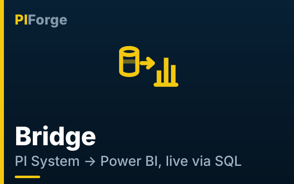</a> <a href="https://piforge.app/product/pi-to-powerbi-bridge"><b>PI-to-PowerBI Bridge</b></a> Stream PI/AF into Power BI via SQL — a lightweight PI Integrator alternative that cuts PI Vision seats <b>$999</b></td><td align="center" valign="top" width="33%"><a href="https://piforge.app/product/pigen">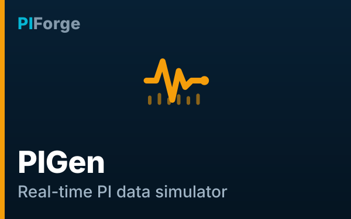</a> <a href="https://piforge.app/product/pigen"><b>PIGen</b></a> PI test-data generator: backfill history, stream live, replay plant upsets <b>$990</b></td><td align="center" valign="top" width="33%"><a href="https://piforge.app/product/piflow">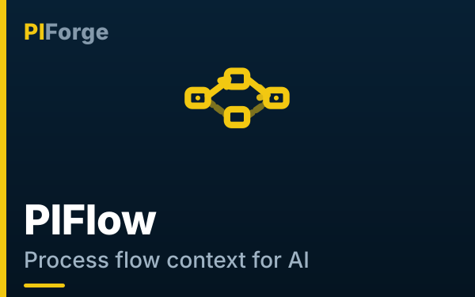</a> <a href="https://piforge.app/product/piflow"><b>PIFlow</b></a> Capture what feeds what, publish it into your AF, and serve it to an LLM over MCP <b>$1499</b></td></tr>
</table>

---

## Free Tools

| Tool | Description | Get it |
|---|---|---|
| **Combo Chart — Free Edition** | Trend line + bar series on one time axis, free for any PI Vision deployment | [GitHub](https://github.com/PIForge-dev/piforge-combo-chart-free) · [GitLab](https://gitlab.com/contact.piforge/piforge-combo-chart-free) |
| **AlarmIQ — Free Edition** | The alarm list PI Vision does not have: drop tags, set a limit, see what is alarming now | [GitHub](https://github.com/PIForge-dev/piforge-alarmiq-free) · [GitLab](https://gitlab.com/contact.piforge/piforge-alarmiq-free) |

## Support

- Marketplace: [piforge.app/market](https://piforge.app/market)
- Documentation: [piforge.app/docs](https://piforge.app/docs)
- Contact: [contact.piforge@gmail.com](mailto:contact.piforge@gmail.com)
